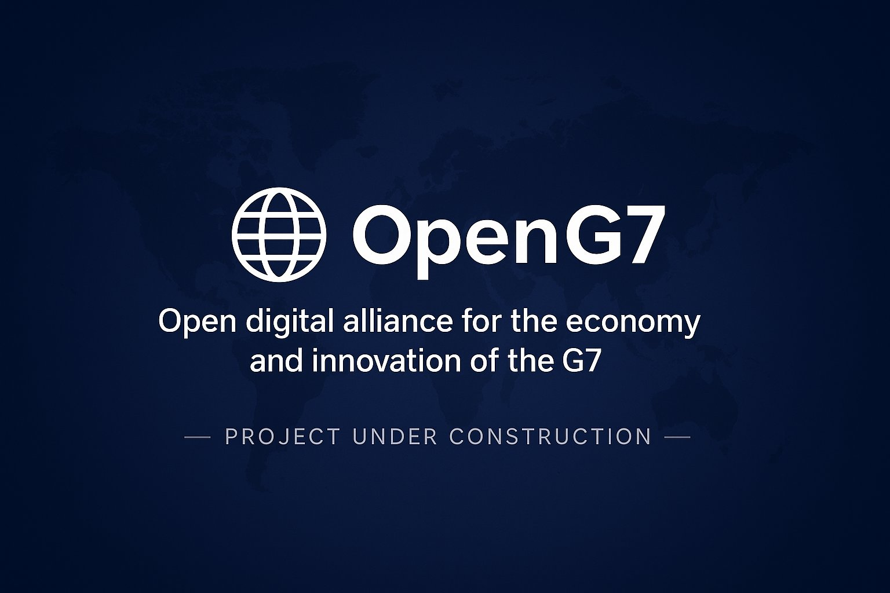
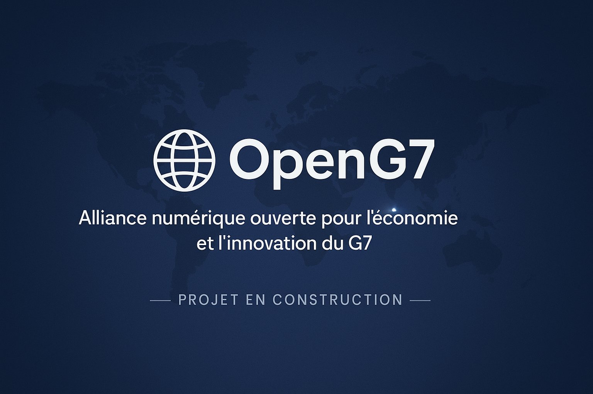

<video src="./assets/openG7-cinematic-720p.mp4"
       controls playsinline muted width="720">
  Votre navigateur ne supporte pas la vidéo intégrée. 
</video>

**Languages:** [English](#english) | [Français](#francais)

# 🌍 OpenG7

---

## 🇬🇧 English

**Open Digital Alliance to connect the economies of the G7**

🚧 **Current Status**: Under construction  
We are building a complete ecosystem to connect G7 economies and inspire a new way of managing IT projects in the AI era.

---

### 🎯 Mission

OpenG7 is an open digital ecosystem in development, designed to:  
- Connect G7 businesses, provinces, countries, and decision-makers through a common platform.  
- Ensure economic responsiveness and resilience to market changes.  
- Serve as a reference in IT project management in the AI era.  
- Inspire governments and IT leaders in their management practices.  
- Open the way to **Humanitarian Aid 2.0** by involving citizens as agents of change.

---

### 🚀 Why it’s innovative

OpenG7 combines **technology**, **artificial intelligence**, and **international cooperation** in a unique ecosystem.  
The economic, logistics, and humanitarian data processed are powerful levers: anticipating crises, optimizing supply chains, and driving innovation.

---

### 🌐 Domains and roles

- **openG7.org**  
  Public official website — presentation, interactive map, business/resource search.  

- **openG7.center**  
  Technical and strategic coordination center — documentation, API, development tracking.

---

### 💡 Use cases

- Find a green energy supplier available immediately.  
- Identify new business partners after losing a market.  
- Detect an imminent supply chain disruption.  
- Quickly raise the profile of a company nationwide.  
- Launch a humanitarian project call in response to a crisis.

---

### 🌍 Humanitarian Aid 2.0

- Any citizen can report a local humanitarian situation.  
- These reports can trigger a project call on the platform.  
- Public, private, and NGO actors can coordinate resources and logistics.

---

### 🏦 Invitation to the Government of Canada

We invite the government to become the lead and strategist for this national project, integrating official data and developing a sovereign digital infrastructure.

---

### 🏦 Benefits for financial institutions

- New financing markets  
- Improved risk analysis  
- Strategic monitoring tool  
- Support for ecological and digital transition  

---

### 🌍 International payments via Wise

OpenG7 uses **Wise** to receive and send funds internationally:  
- Multi-currency accounts, transparent fees, fast transfers.  
- Regulatory compliance (Wise is a FINTRAC-registered MSB in Canada).  
- ⚠️ Wise is not a bank; funds are “safeguarded” but not CDIC insured.

**Accelerating OpenG7 via Wise**  
Target: **CAD 1,000,000** for 12–18 months of accelerated development (no maximum).  
Additional funding will enable a full-time development team and faster feature delivery.

**How to contribute**:  
- **From Canada (CAD)**: Interac transfer or bank transfer to our Wise CAD account.  
- **International**: Local transfer (USD/EUR/GBP) or SWIFT to our Wise account.

📩 Request details: contact@openg7.org *(Subject: Wise Contribution – OpenG7)*

---

### 🧩 Financial governance

- Dual validation for each payment (“four eyes” principle).  
- Payment thresholds and automatic alerts.  
- Annual audit by an independent third party.

---

### 📢 Official channels

📧 contact@openg7.org  
💬 Discord *(coming soon)*  
🔗 LinkedIn *(coming soon)*  

---

### 📜 License

Apache-2.0 — see LICENSE file.

---

## 🇫🇷 Français

**Alliance numérique ouverte pour connecter les économies du G7**

🚧 **Statut actuel** : En construction  
Nous bâtissons un écosystème complet pour connecter les économies du G7 et inspirer une nouvelle façon de gérer les projets TI à l’ère de l’intelligence artificielle.

---

### 🎯 Mission

OpenG7 est un écosystème numérique ouvert en construction, conçu pour :  
- Connecter les entreprises, provinces, pays et décideurs du G7 via une plateforme commune.  
- Assurer une réactivité et une résilience économiques face aux changements de marchés.  
- Servir de référence en gestion de projet informatique à l’ère de l’IA.  
- Inspirer les gouvernements et responsables TI dans leurs pratiques de gestion.  
- Ouvrir la voie à **l’Aide humanitaire 2.0** en intégrant les citoyens comme acteurs du changement.

---

### 🚀 Pourquoi c’est innovateur

OpenG7 combine **technologie**, **intelligence artificielle** et **coopération internationale** dans un écosystème unique.  
Les données économiques, logistiques et humanitaires traitées sont de véritables leviers : anticiper les crises, optimiser les chaînes d’approvisionnement et stimuler l’innovation.

---

### 🌐 Noms de domaine et rôles

- **openG7.org**  
  Site officiel grand public — présentation, carte interactive, moteur de recherche.

- **openG7.center**  
  Centre de coordination technique et stratégique — documentation, API, suivi des développements.

---

### 💡 Cas d’usage

- Trouver un fournisseur en énergie verte disponible immédiatement.  
- Identifier de nouveaux partenaires commerciaux après la perte d’un marché.  
- Détecter une rupture imminente dans une chaîne d’approvisionnement.  
- Faire connaître rapidement une entreprise à l’échelle nationale.  
- Initier un appel de projet humanitaire en réponse à une crise.

---

### 🌍 Aide humanitaire 2.0

- Tout citoyen peut signaler une situation humanitaire locale.  
- Ces témoignages peuvent déclencher un appel de projet sur la plateforme.  
- Les acteurs publics, privés et ONG peuvent coordonner les ressources et la logistique.

---

### 🏦 Invitation au gouvernement du Canada

Nous invitons le gouvernement à devenir porteur et stratège de ce projet national, avec intégration de données officielles et développement d’une infrastructure numérique souveraine.

---

### 🏦 Avantages pour les institutions financières

- Nouveaux marchés pour le financement  
- Analyse de risque améliorée  
- Outil de veille stratégique  
- Soutien à la transition écologique et numérique  

---

### 🌍 Paiements internationaux via Wise

OpenG7 utilise **Wise** pour recevoir et envoyer des fonds à l’international :  
- Comptes multi-devises, frais transparents, virements rapides.  
- Conformité réglementaire (Wise est un MSB enregistré FINTRAC au Canada).  
- ⚠️ Wise n’est pas une banque ; fonds “safeguarded” non assurés CDIC.

**Accélérer OpenG7 via Wise**  
Objectif : **1 000 000 $ CAD** pour 12–18 mois de développement accéléré (montant non limitatif).  
Des fonds supplémentaires permettront de constituer une équipe de développement à temps plein et d’accélérer la livraison des fonctionnalités.

**Comment contribuer** :  
- **Depuis le Canada (CAD)** : virement Interac ou virement bancaire vers nos coordonnées Wise CAD.  
- **International** : virement local (USD/EUR/GBP) ou SWIFT vers nos coordonnées Wise.

📩 Demande de coordonnées : contact@openg7.org *(Objet : Contribution Wise – OpenG7)*

---

### 🧩 Gouvernance financière

- Double validation de chaque paiement (“quatre yeux”).  
- Seuils de paiement et alertes automatiques.  
- Audit annuel par un tiers indépendant.

---

### 📢 Canaux officiels

📧 contact@openg7.org  
💬 Discord *(à venir)*  
🔗 LinkedIn *(à venir)*  

---

### 📜 Licence

Apache-2.0 — voir le fichier LICENSE.
